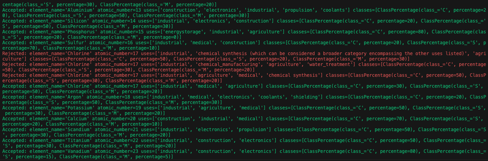

# ollama-pydantic example

# Project Overview

This project includes three Python scripts designed to interact with different data sources and update specific fields in JSON or MongoDB documents. The scripts leverage the Ollama API for data classification and the Pydantic library for data validation.

# Problem
## Asteroids

With a collection of [958524 asteroids, thanks to https://www.kaggle.com/datasets/sakhawat18/asteroid-dataset](https://www.kaggle.com/datasets/sakhawat18/asteroid-dataset), it is important for my usecase that they have a `class` of either `C` (Carbonaceous),`S` (Silicaceous),`M` (Metallic) or `O` (Other, unclassified).  I used Pydantic and Ollama to read each asteroid name and update it's document with its classification.

## Elements
119 Elements in the periodic table, they each needed to be classified for it's possible uses out of `"fuel", "lifesupport", "energystorage", "construction", "electronics", "coolants", "industrial", "medical", "propulsion", "shielding", "agriculture", "mining"`. I also wanted to show the likelyhood of each element appearing in each class of asteroid [`C`, `S` and `M`].  I used Pydantic and Ollama to read each element and update it's document with its uses and classes.

## Scripts

### 1. `update_element_uses.py`

This script reads element data from a JSON file, validates the data using Pydantic models, and updates the JSON file with validated uses and classes for each element.

#### Capabilities:
- Reads element data from `elements.json`.
- Uses Pydantic models to validate element data.
- Validates that the `classes` field includes "C", "S", and "M"
- Updates the `uses` and `classes` fields in the JSON file.
- Debugging support with color-coded output using `colorama`.

### 2. `update_element_uses_mdb.py`

This script reads each of the 119 elements data from a MongoDB collection, validates the data using Pydantic models, and updates the MongoDB documents with validated uses and percentage of likelyhood of each element appearing in C, S, M class asteroids.

The expectation is that the AI, depending on model, may have a hard time with following structured responses.  This is where we retry the query with the AI until we can parse it's response as being "valid" using Pydantic.  The `Rejected` results you see in the screenshot represent where the AI responded with it's own usecase (that I will certainly consider), but my objective is to be able to group elements by the above mentioned usecases.  In this case it took 3 failed attempts before the AI finally responded with the valid answer for Chlorine.

#### Capabilities:
- Connects to a MongoDB database using a URI from environment variables.
- Uses Pydantic models to validate element data.
- Validates that the `classes` field includes "C", "S", and "M"
- Updates the `uses` and `classes` fields in MongoDB documents.
- Debugging support with color-coded output using `colorama`.

### 3. `update_asteroids_classes.py`

This script reads asteroid data from a MongoDB collection, validates the data using Pydantic models, and updates the MongoDB documents with validated classes for each asteroid.

#### Capabilities:
- Connects to a MongoDB database using a URI from environment variables.
- Uses Pydantic models to validate asteroid data.
- Validates that the `class` field is one of "C", "S", or "M".
- Updates the `class` field in MongoDB documents only if it doesn't already exist.
- Debugging support with color-coded output using `colorama`.

## Usage

### Environment Setup

1. Create a `.env` file in the project root directory with the following variables:
    ```env
    OLLAMA_URI=http://localhost:11434
    MONGO_URI=mongodb://localhost:27017
    OLLAMA_MODEL=granite3.1-dense:8b
    ```

2. Install the required Python packages:
    ```sh
    pip install -r requirements.txt
    ```

### Running the Scripts

1. **`update_element_uses.py`**:
    ```sh
    python update_element_uses.py
    ```

2. **`update_element_uses_mdb.py`**:
    ```sh
    python update_element_uses_mdb.py
    ```

3. **`update_asteroids_classes.py`**:
    ```sh
    python update_asteroids_classes.py
    ```

## Debugging

- Set `DEBUG = True` in the scripts to enable debug printing with color-coded output.
- Set `OVERWRITE_CLASS = True` in [update_asteroids_classes.py]() to overwrite existing class fields.

## Notes

- Ensure that the MongoDB server is running and accessible via the URI specified in the [.env]() file.
- The [elements.json]() file should be present in the project root directory for [update_element_uses.py]().

This README provides an overview of the capabilities and usage of the scripts in this project. For more detailed information, refer to the individual script files.
